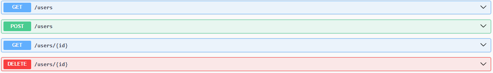

#nodeUsers-SUPA
# 🧠 API de Usuários com Node.js, Express e Supabase

Este projeto é uma API simples desenvolvida com Node.js e Express que realiza operações de CRUD em um banco de dados Supabase. A aplicação também conta com documentação interativa via Swagger.

## ⚙️ Tecnologias Utilizadas

- Node.js
- Express.js
- Supabase (PostgreSQL)
- Swagger (swagger-ui-express)
- Dotenv

---

## 🚀 Como rodar o projeto

### 1. Instale as dependências

```bash
npm install
```

### 2. Altere o arquivo `.env`

Crie um arquivo `.env` na raiz do projeto com as seguintes variáveis:

```env
PORT=3000
URL=https://SEU-PROJETO.supabase.co
API=SUA-API-KEY
```

> Substitua `URL` e `API` com os dados reais da sua instância Supabase.

---

### 3. Estrutura exata do banco Supabase

Execute o seguinte script SQL no seu painel Supabase para criar a tabela exatamente como usada na aplicação:

```sql
create table public.usuario (
  id bigint generated by default as identity not null,
  created_at timestamp with time zone not null default now(),
  nome character varying null,
  email character varying null,
  data_nascimento date null,
  constraint usuario_pkey primary key (id)
) TABLESPACE pg_default;
```

---

### 4. Inicialize o servidor

Utilize o comando abaixo para iniciar o servidor com `nodemon`:

```bash
npx nodemon index.js
```

O servidor será iniciado na porta configurada no `.env` (por padrão, 3000).

---

### 📫 Testando as rotas

As rotas da API podem ser acessadas via Postman ou qualquer outro cliente HTTP:

- **GET** `/api/users` → Lista todos os usuários
- **GET** `/api/users/:id` → Retorna um único usuário
- **POST** `/api/users` → Cria um novo usuário
- **DELETE** `/api/users/:id` → Deleta um usuário

---

### 📘 Documentação Swagger

Acesse a documentação interativa via Swagger em:

```
http://localhost:3000/api-docs
```

---


---
### ⚙️ Caso queira usar uma tabela diferente de 'usuario', altere o nome em:

 services/userService.js

Após isso verifique se userRoutes e userController estão apontando corretamente para a nova tabela.
